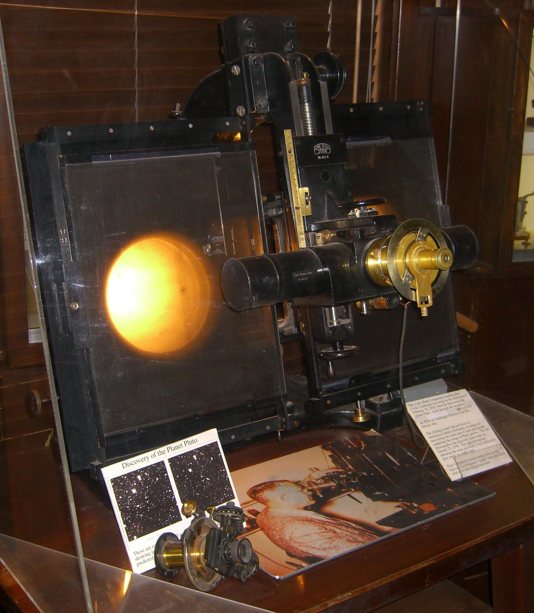
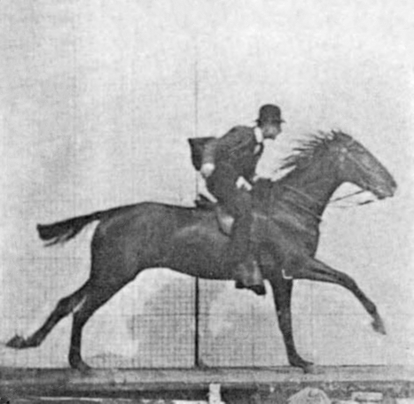

# Blick Comparator

The Blink Comparator is by today's standards an incredibly simple device. Using it, two images could be flipped one to the other and back to the first. The idea is that any differences between the two images would be easy to detect. Clyde Tombaugh used the one below to discover Pluto in 1930.



We will write a program in a few lines of Python to duplicate Tombaugh's discovering using the very same images.

After that *you* will rewrite the program to take another trip down memory lane to display this:



from ~1872.

## opencv

We will be using the OpenCV package for Python. OpenCV is a *super comprehensive* suite of computer vision software routines used in thousands of applications in robotics, visual effects, image editing and self-driving cars to name a few.

The required packages should already be installed. Test this using interactive Python.

```text
> python3
Python 3.6.9 (default, Nov  7 2019, 10:44:02) 
[GCC 8.3.0] on linux
Type "help", "copyright", "credits" or "license" for more information.
>>> import cv2
>>> exit()
>
```

Remember, on your computer you may need to type `python3` or just `python` and you will likely get a different Python version - which **must** begin with 3.

## Step 1 - ensure the two pictures are in the right place

1. Create a folder called `blink`
2. Download [p1.jpg]() and [p2.jpg]()
3. Put both in the folder named `blink`
4. Start a program called `blink.py`
5. Enter
```python
import cv2

images = []
images.append(cv2.imread('p1.jpg'))
images.append(cv2.imread('p2.jpg'))
```
6. Save and attempt to run this program. If there is no output, all is well. If any errors occur, all is not well.

### Discussion

Our goal is to switch between two images, to *ping-pong* between them so to speak. 

`images` is declared as an empty list.

`cv2.imread()` is given the name (or path) to the image to load. The return value is immediately appended to `images`. Note that this code does not perform well in the presence of errors. In fact, it performs no error checking at all.

After executing this code, `images[0]` and `images[1]` contain the image information for `p1.jpg` and `p2.jpg`

